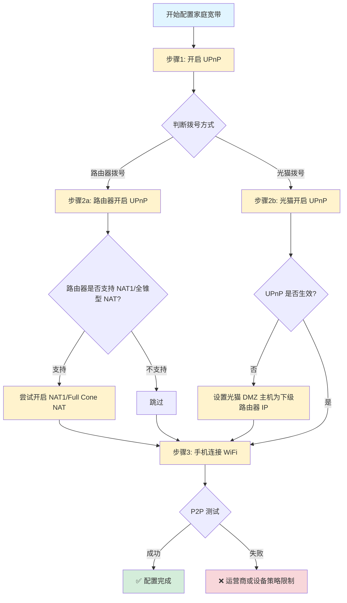

# DipGonc

## 项目简介

 DipGonc是一个实现手机与DiPlus车机软件之间通过Gonc直接 P2P（点对点）通信的项目。本项目旨在建立手机与车机之间的直接通信链路，避免依赖中转服务器，实现直接查看Diplus哨兵录像的能力。

## 网络背景与挑战

### 网络环境分析
- **BYD 车机网络**：大多数是移动卡，为 NAT4 类型且不支持 IPv6。有部分车机使用联通卡，有IPV6。
- **手机网络**：多数为 NAT4 类型，但通常支持 IPv6
- **P2P 连接限制**：当两端均为 NAT4 时无法实现直接穿透

### NAT 类型兼容性
| 发起方 NAT 类型 | 接收方 NAT 类型 | 连接可能性 |
|----------------|----------------|-----------|
| NAT1           | NAT4           | ✅ 可连接   |
| NAT4           | NAT1           | ✅ 可连接   |
| NAT4 + IPv6    | NAT4 + IPv6    | ✅ 可连接   |
| NAT4           | NAT4           | ❌ 不可连接 |

## 解决方案

### 方案一：车机使用 USB 随身WiFi（推荐）
**适用场景**：车机USB口插随身WIFI，可选择有IPV6的随身WIFI，可实现直连

**注意事项**：USB随身WIFI一般发热巨大，有烧车机或USB口的风险，建议选择电流需求小的方案，另外建议用一根短USB延长线引出来防止USB口过热。

### 方案二：手机连接家庭宽带网络
**适用场景**：手机在家中连接 WiFi，希望通过家庭宽带提高 P2P 成功率。

家庭宽带不一定必须改成 NAT1。很多情况下，只要能让路由器自动放行需要的端口，就可以提高穿透成功率。建议按下面流程图操作：

**详细操作说明**：

1. **先开启 UPnP**  
   在路由器管理页面中开启 UPnP，让设备按需自动申请端口映射。对普通用户来说，这是最简单、风险最低的方式。

2. **如果是路由器拨号**  
   宽带账号由家里的路由器拨号时，可以尝试在路由器里开启 UPnP；如果路由器支持 NAT1、全锥型 NAT、Full Cone NAT，也可以尝试开启。

3. **如果是光猫拨号**  
   宽带账号由光猫拨号、路由器只是接在光猫后面时，优先尝试在光猫里开启 UPnP。若仍然不通，可以在光猫中设置 DMZ 主机为下级路由器IP，让外部流量先转给路由器，再由路由器处理。

4. **再连接手机 WiFi 测试**  
   手机连接该家庭 WiFi 后重新测试 P2P。若仍失败，说明当前运营商、光猫或路由器策略仍可能限制穿透。

**注意事项**：
- 光猫管理页面可能需要运营商超级管理员密码（常说的“超密”），普通账号可能看不到 UPnP、DMZ 等选项。
- NAT1/全锥型 NAT、UPnP、DMZ 的名称在不同品牌设备上可能不同。
- DMZ 会把更多入站流量交给下级路由器处理，建议只把 DMZ 指向自己的路由器，不要指向不可信设备。
